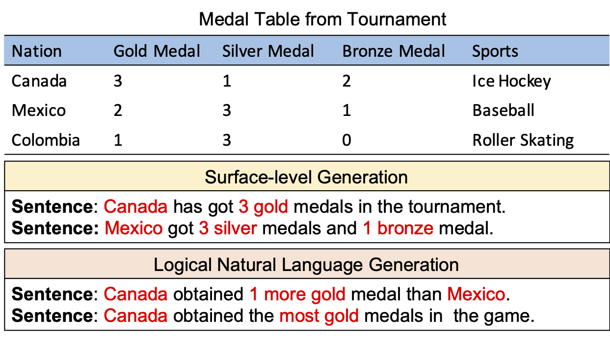

# LogicNLG
The data and code for ACL2020 paper [Logical Natural Language Generation from Open-Domain Tables](https://arxiv.org/abs/2004.10404), which aims to study the problem of natural language generation with logical inference in the intermediate steps. Going beyond simply surface-level copying, LogicNLG requires the model to deeply understand the content in the table and infer information implicitly expressed by the table.

<p align="center">

</p>

## Demo
You can explore the [visualization interface](https://wenhuchen.github.io/logicnlg.github.io/) to see the generation results of different models on LogNLG. Have fun!

## Requirements
- pytorch 1.4.0
- huggingface transformers 2.5.1
- tensorboardX
- tqdm
- apex [optional]

## Training/Evaluation Data
The data used for LogicNLG is provided in [data](https://github.com/wenhuchen/LogicNLG/blob/master/data) folder, the details are described in [README](https://github.com/wenhuchen/LogicNLG/blob/master/data/README.md)

## Preparation
### Unzip all the table files
```
unzip all_csv.zip
```

### Download the NLI scorer
```
wget https://logicnlg.s3-us-west-2.amazonaws.com/NLI_models.zip
unzip NLI_models.zip
```

### Download the Semantic Parser
```
wget https://logicnlg.s3-us-west-2.amazonaws.com/parser_models.zip
unzip parser_models.zip
```

## Reproducing Reported Results From Automatic Metric Models
The generated output from Field-Infusing-Transformer,GPT-2-based, Coarse-to-Fine models are stored in [outputs](https://github.com/wenhuchen/LogicNLG/blob/master/outputs). Their corresponding parsing results are stored in [program_outputs](https://github.com/wenhuchen/LogicNLG/blob/master/program_outputs). 

### You can verify their BLEU score by: 
```
python evaluate.py outputs/field_infusing.json data/test_lm.json
python evaluate.py outputs/GPT_gpt2_12.65.json data/test_lm.json
python evaluate.py outputs/GPT_gpt2_C2F_13.35.json data/test_lm.json
```
### You can verify their NLI-Acc by:
```
CUDA_VISIBLE_DEVICES=0 python NLI.py --model bert-base-multilingual-uncased --do_verify --encoding gnn --load_from NLI_models/model_ep4.pt --fp16 --verify_file outputs/GPT_gpt2_C2F_13.35.json --verify_linking data/test_lm.json
```
### You can verify their SP-Acc by:
```
CUDA_VISIBLE_DEVICES=0 python parse_programs.py --compute_score --load_from parser_models/model.pt --score_file program_outputs/GPT_gpt2_C2F_13.35.json
```

## Loading Our Trained Models
You are download and reload our trained models from Amazon S3 and decode results from them.
```
wget https://logicnlg.s3-us-west-2.amazonaws.com/models.zip
unzip models.zip
```
### For GPT-2.py model
You can either decode the sentences 
```
CUDA_VISIBLE_DEVICES=0 python GPT2.py --do_test --load_from models/GPT_ep8.pt
```
or evaluate the Adv-Acc
```
CUDA_VISIBLE_DEVICES=0 python GPT2.py --do_verify --load_from models/GPT_ep8.pt
```
### For Coarse-to-Fine model
You can either decode the sentences 
```
CUDA_VISIBLE_DEVICES=0 python GPT2-coarse-to-fine.py --do_test --load_from models/GPT_stage2_C2F_ep13.pt
```
or evaluate the Adv-Acc
```
CUDA_VISIBLE_DEVICES=0 python GPT2-coarse-to-fine.py --do_verify --load_from models/GPT_stage2_C2F_ep13.pt --stage 2
```
These commands will save the decoded sentences to outputs/ folder and print out the Adv-Acc scores reported in the paper.

## Retrain Your Own Model
### Train Field-Infusing Transformer
```
CUDA_VISIBLE_DEVICES=0 python Transformer.py --do_train
```
### Train GPT2-small Model
```
CUDA_VISIBLE_DEVICES=0 python GPT2.py --do_train --model gpt2
```
If you are running on a cluster of multiple nodes, you can also try our distributed training recipe:
```
CUDA_VISIBLE_DEVICES=0,1,2,3 python -m torch.distributed.launch --nproc_per_node 4 GPT-distributed.py --do_train --model gpt2 --batch_size 4
```
### Train GPT2-Coarse-to-Fine Model
1. Warm-up the template generation model for 10 epochs
```
CUDA_VISIBLE_DEVICES=0 python GPT2-coarse-to-fine.py --do_train --model gpt2 --stage 1
```
2. Load the last model and then train the fine-grained surface realization model for 15 epochs and smaller batch size.
```
CUDA_VISIBLE_DEVICES=0 python GPT2-coarse-to-fine.py --do_train --model gpt2 --stage 2 --epochs 15 --batch_size 3 --load_from models/GPT_stage1_C2F_ep9.pt
```
The trained models are stored under models/ folder, you can reload them and evaluate.

## Evaluation Command
### Compute Adv-ACC score
```
python GPT2.py --do_verify --load_from models/[Your_Model] --model gpt2
python GPT2-coarse-to-fine.py --do_verify --load_from models/[Your_Model] --model gpt2 --stage 2
```

### Compute BLEU-1/2/3 score
```
CUDA_VISIBLE_DEVICES=0 python GPT2.py --do_test --load_from models/[Your_Model] --model gpt2
CUDA_VISIBLE_DEVICES=0 python GPT2-coarse-to-fine.py --do_test --load_from models/[Your_Model] --model gpt2
```
After running do_test command, the decoded results on test split will be saved into outputs/ folder, which is required for the following NLI-Acc and SP-Acc score computation.

### Compute NLI-Acc score
```
CUDA_VISIBLE_DEVICES=0 python NLI.py --model bert-base-multilingual-uncased --do_verify --encoding gnn --load_from NLI_models/model_ep4.pt --fp16 --verify_file outputs/[Your_File] --verify_linking data/test_lm.json
```

### Compute SP-Acc score
1. Parsing your output file into programs (**warning**: this program uses breadth first search for potential programs, and could take a long time if you don't have many cpu cores. The experimented machine has 64 cores, and the parsing takes 30-60 minutes.):
```
python parse_programs.py --parse --score_file outputs/[Your_File]
```
2. Run the ranker model to predict the entailment relationship:
```
CUDA_VISIBLE_DEVICES=0 python parse_programs.py --compute_score --load_from parser_models/model.pt --score_file program_outputs/[Your_File]
```

### Parser and Entity Linker
We provide the details of our parser in [README](https://github.com/wenhuchen/LogicNLG/blob/master/LINKING.md).

## Codalab
We host challenge of LogicNLG in [CodaLab](https://competitions.codalab.org/competitions/24527). Please consider submit your results to the challenge site. 
```
CUDA_VISIBLE_DEVICES=0 python GPT2-coarse-to-fine.py --do_verify_challenge --load_from models/GPT_stage2_C2F_ep13.pt --stage 2
CUDA_VISIBLE_DEVICES=0 python GPT2-coarse-to-fine.py --do_test_challenge --load_from models/GPT_stage2_C2F_ep13.pt --model gpt2
```
These two commands will output results "verify_results.json" and "test_results.json" in the challenge folder, please remember to zip your files before submission.
```
cd challenge
zip -r results.zip verify_results.json test_results.json
```

## Recent Papers


**Model**                                     |  **Organization**  |**Reference**                                                             | **BLUEU-1** | **BLEU-2** | **BLEU-3** | **SP-Acc** |   **SP-Acc** |
----------|---------------------------|-----------------------------------|---------------------------------------------------------------------------|---------|----------|------------------|------|
GPT-TabGen                 | UCSB          |    [Chen et al.](https://arxiv.org/abs/2004.10404)     | 48.8            |    27.1    |   12.6  |   42.1  | 68.7  |
GPT-Coarse-to-Fine         | UCSB          |   [Chen et al.](https://arxiv.org/abs/2004.10404)      |   46.6        |    26.8   |  13.3  |   42.7 |  72.2  |
DCVED     | Shanghai Jiao Tong University          |  [Chen & Jin et al.](https://aclanthology.org/2021.acl-long.430.pdf)  |    49.5                 |   28.6  |  15.3  |   43.9   |  76.9 |


## Miscellaneous
If you find any problem about the code, please leave an issue or shoot me an email.
